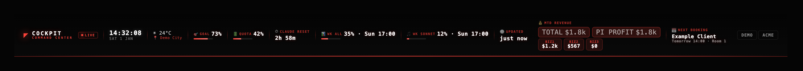

# Cockpit



Turn your Paperclip dashboard into a dark, glassy command center.

Clock. Weather. Revenue. Bookings. AI-quota. All visible at once. No switching, no tabs.

## The HUD You Actually Want

You live in your dashboard. It should look like it.

Cockpit is a drop-in theme for Paperclip that adds a cinematic mission-control header bar — everything that matters, visible at a glance:

- **Live clock & local weather** — know what's happening outside without leaving your screen
- **AI-quota countdown** — your Claude Max session/weekly limits, auto-tracking
- **Month-to-date revenue** — Stripe sync, live
- **Next client booking** — never miss an appointment
- **Security camera link** — one-tap access
- **Cinematic boot screen** — because your dashboard startup should look intentional

Ships with zero personal data. Wire it to your own Stripe, weather API, and calendar in ~5 minutes.

---

*For indie hackers, solo founders, and power-users who spend their day in one window.*

---

## Quick start

```bash
# 1. Clone this repo somewhere durable (NOT inside node_modules)
git clone <your-fork> ~/coding/paperclip-theme && cd ~/coding/paperclip-theme

# 2. Fill in the placeholders (see "Placeholders" below) — at minimum the brand.

# 3. Apply the theme to your local Paperclip install
./apply-theme.sh            # apply
./apply-theme.sh --check    # verify (exit 0 = fully applied)

# 4. Hard-refresh the browser (Cmd/Ctrl+Shift+R).
```

`apply-theme.sh` copies the assets into
`<NPM_GLOBAL>/paperclipai/node_modules/@paperclipai/server/ui-dist/` and injects a
`<!-- COCKPIT_START/END -->` block before `</head>`. If paperclipai isn't at the
Homebrew default path, override it: `NPM_GLOBAL=/usr/local/lib/node_modules ./apply-theme.sh`.

See **`REDEPLOY.md`** for versioning, rollback, and durability (launchd/cron).

---

## Tutorial — plug in your own data (step by step)

Everything below is **optional and independent**: skip any step and that cell just
shows `—`. Do them in any order. **Golden rule: real keys and data live only in
the `*.json` files you create by copying an `*.example.json` — those copies are
gitignored and must never be committed.**

**Step 0 — Name your cockpit.** Open `cockpit-command-center.js` and
`cockpit-loader.js`, set the `BRAND_*` defaults (or set `window.__COCKPIT_BRAND__`
once — see *Branding* below). Run `./apply-theme.sh` and hard-refresh. That alone
gives you the full skin.

**Step 1 — Weather & location.** In `cockpit-command-center.js` set
`__YOUR_CITY__` in `DEFAULT_LOCATION` (optional — IP geolocation overrides it).
Nothing else to wire; weather is a free, keyless API.

**Step 2 — Calendar / "next booking".** Rename the cell to fit your business via
`__YOUR_BOOKING_LABEL__` (e.g. `NEXT APPOINTMENT`, `NEXT MEETING`). Then feed it data:
1. `cp config.example.json config.json` (gitignored).
2. In `config.json`, put your **iCal feed URL** in `icalUrl` (Google Calendar →
   Settings → *Secret address in iCal format*).
3. Run a small proxy on port `3102` that reads that feed and writes
   `/assets/cockpit-booking.json` in the shape of `cockpit-booking.example.json`.
   (The proxy is yours to write — the cockpit only cares about the JSON shape.)

**Step 3 — Revenue (Stripe).** Wire month-to-date revenue per business:
1. `cp stripe-config.example.json stripe-config.json` (gitignored).
2. For each business, create a Stripe **restricted, read-only key** (Dashboard →
   Developers → API keys → *Create restricted key* → Charges/Balance: Read). Put
   one per `accounts[].key`. **Never use your secret key. Never commit this file.**
3. Set your business `code`s here and make them match `REV_ORDER` / `REV_WEIGHTS`
   in `cockpit-command-center.js` (with your real ownership `%` weights).
4. Run a proxy on port `3103` that writes `/assets/cockpit-revenue.json` in the
   shape of `cockpit-revenue.example.json`.

**Step 4 — Claude Max quota (optional).** Set `__YOUR_QUOTA_RESET_ANCHOR_ISO__` to
one reset time you see on claude.ai. For the *real* % (instead of the estimate),
run an hourly job that scrapes `claude.ai/settings/usage` and writes
`/assets/cockpit-quota.json` in the shape of `cockpit-quota.example.json`. This
reads **your own** usage only — there is no shared key or third-party call.

**Step 5 — Cameras (optional).** Set `__YOUR_CAMERA_URL__` to your NVR/camera web
URL to reveal the **CAMS** button. Left blank, the button stays hidden.

**Step 6 — Apply.** `./apply-theme.sh && ./apply-theme.sh --check`, then hard-refresh.

> Where keys go, in one line: **iCal URL → `config.json`**, **Stripe restricted
> keys → `stripe-config.json`**. Both are gitignored; the `.example.json` siblings
> are just shape references with fake values.

---

## Placeholders

Search the tree for `__` to find them. The important ones:

| Placeholder | File | What to set it to |
|---|---|---|
| `__YOUR_BRAND_NAME__` / `__YOUR_BRAND_SUBTITLE__` | `cockpit-command-center.js`, `cockpit-loader.js` | Your cockpit name (see **Branding** below) |
| `__YOUR_CAMERA_URL__` | `cockpit-command-center.js` | Your security-camera/NVR web URL. Left as-is, the **CAMS** button is hidden. |
| `__YOUR_BOOKING_LABEL__` | `cockpit-command-center.js` | The calendar cell label — e.g. `NEXT BOOKING`, `NEXT APPOINTMENT`, `NEXT MEETING`. |
| `__YOUR_CITY__` | `cockpit-command-center.js` | Default map city; IP geolocation overrides it at runtime anyway. |
| `__YOUR_QUOTA_RESET_ANCHOR_ISO__` | `cockpit-command-center.js` | One Claude Max session-reset time you observe on claude.ai, e.g. `2026-01-01T00:00:00Z`. The countdown auto-rolls forward every 5h from it. |
| `__YOUR_BUSINESS_CODES__` / `__YOUR_OWNERSHIP_WEIGHTS__` | `cockpit-command-center.js` (`REV_ORDER`, `REV_WEIGHTS`) | Your business codes + your profit share per business (`1.00` = 100%). |
| `__YOUR_DOMAIN__` | `REDEPLOY.md` | The public hostname you tunnel Paperclip to (if any). |

You can run the theme with **just the brand set** — every data feature degrades
gracefully to `—` when its data source is absent.

### Branding (single config point)

The cockpit name appears in the header and the boot screen. Set it once, before
the cockpit scripts load, via a global — this overrides the placeholders in both
files without editing them:

```html
<script>
  window.__COCKPIT_BRAND__ = {
    name: 'ACME',                  // big brand word
    sub:  'COMMAND CENTER',        // subtitle
    boot: 'ACME BOOT SEQUENCE',    // boot-screen footer caption
    bookingLabel: 'NEXT APPOINTMENT' // calendar cell label
  };
</script>
```

Or just edit the `BRAND` defaults at the top of `cockpit-command-center.js` and
`cockpit-loader.js`.

---

## Data wiring (optional, but it's the fun part)

Four live data features read **same-origin JSON** served from Paperclip's
`/assets/`. Each has an `*.example.json` in this repo documenting its exact shape.
You produce the real files yourself (a small proxy/scraper writing into
`ui-dist/assets/`); the real files are **gitignored** and never committed.

| Feature | Same-origin file | Local proxy fallback | Shape |
|---|---|---|---|
| Next booking | `/assets/cockpit-booking.json` | `http://127.0.0.1:3102/booking` | `cockpit-booking.example.json` |
| MTD revenue | `/assets/cockpit-revenue.json` | `http://127.0.0.1:3103/revenue` | `cockpit-revenue.example.json` |
| Claude quota | `/assets/cockpit-quota.json` | — | `cockpit-quota.example.json` |

The cockpit tries the same-origin file **first** (so it works from any device /
remote browser), then falls back to the localhost proxy (works only on the host
machine). A `?t=` cache-buster keeps the immutable `/assets` snapshot fresh.

### Booking (iCal)

Point a tiny proxy at any iCal feed (Google Calendar, etc.) and have it emit
`cockpit-booking.example.json`'s shape. Config shape: `config.example.json` →
copy to `config.json` (gitignored). The cockpit shows the next **real client**
booking — your proxy is responsible for filtering out holds/blocks.

### Revenue (Stripe)

Run a proxy that reads month-to-date charges per business and emits
`cockpit-revenue.example.json`'s shape (per-business `usd`, converted via an FX
API). Config shape: `stripe-config.example.json` → copy to `stripe-config.json`
(gitignored). **Use Stripe *restricted, read-only* keys — never your secret key,
and never commit them.** Business codes must match `REV_ORDER` / `REV_WEIGHTS`
in `cockpit-command-center.js`. The bar shows each business plus a gross **TOTAL**
and an ownership-weighted **PI PROFIT** total.

### Claude quota

Claude Max usage isn't API-exposed, so an hourly job can scrape
`claude.ai/settings/usage` and write `cockpit-quota.example.json`'s shape to
`/assets/cockpit-quota.json`. If that file is missing or stale (>95 min old) the
cockpit falls back to a **run-volume estimate** windowed to the 5h session and a
rolling reset anchor — so the QUOTA/RESET cells never blank. (Building the
scraper is left to you; only the JSON contract is part of this template.)

---

## File map

| File | Role |
|---|---|
| `apply-theme.sh` | Idempotent installer/self-healer. Single source of truth for `THEME_VERSION`. |
| `paperclip-cockpit-theme-v26.css` | The full cockpit stylesheet. |
| `cockpit-injector.js` | Injects the stylesheet + webfonts; clears stale SW caches on version change. |
| `cockpit-canvas-grid.js` | Animated grid + corner-glow canvas backdrop. |
| `cockpit-command-center.js` | The top HUD bar (clock, weather, quota, revenue, booking, links). |
| `cockpit-loader.js` | Boot/loading screen shown on full page loads. |
| `cockpit-sw.js` | Network-first service worker; `CACHE_NAME` carries the version. |
| `*.example.json` | Shape docs for the data files you provide. |
| `REDEPLOY.md` | Versioning, rollback, and durability runbook. |

> The `cockpit-*` filenames and `cmd-*` / `cockpit-boot-*` CSS classes are internal
> codenames — they don't appear in the UI. Rename if you like, but keep the JS
> filenames and CSS class names in sync (and update `apply-theme.sh`).

---

## Security / privacy

- **Whitelist `.gitignore`.** This repo ignores *everything* and re-includes only
  theme assets + `*.example.json`. Your real `config.json`, `stripe-config.json`,
  `cockpit-*.json`, keys, and logs **cannot** be committed by accident.
- Keep API keys in the gitignored config files, and prefer restricted/read-only
  keys.
- This template ships with placeholder values only — no real endpoints, keys,
  coordinates, or hostnames.

---

## License

Provided as-is, for personal use. No warranty.
